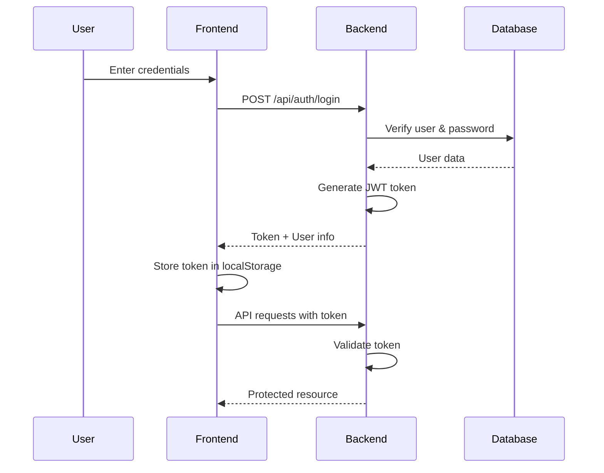
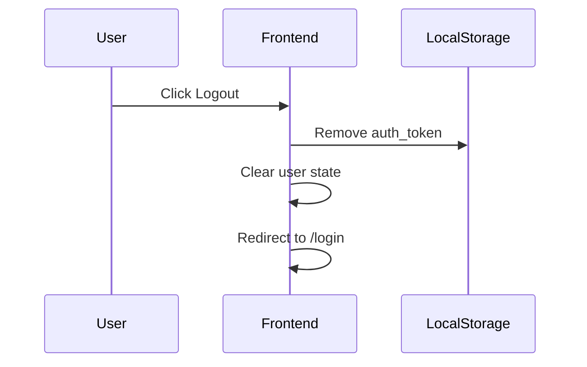
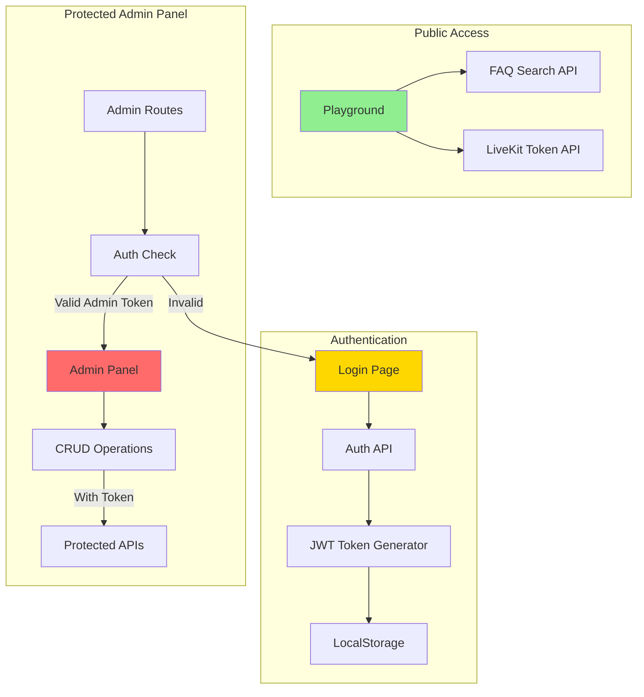

# Authentication System Guide

## Overview

The Voice Concierge system now implements **role-based authentication** with JWT tokens to secure the admin panel while maintaining public access to the voice playground.

---

## Architecture

### 🔐 **Authentication Flow**



---

## User Roles

### **Admin** 
- Full access to admin panel
- Can manage FAQs (Create, Edit, Delete)
- Can view and manage unanswered questions
- Can change voice configuration
- **Default**: `username: admin` / `password: admin123`

### **Guest**
- Access to voice playground
- Can search FAQs (read-only)
- Cannot access admin panel
- **Default**: `username: guest` / `password: guest123`

---

## Access Control Matrix

| Feature | Guest | Admin | Authentication Required |
|---------|-------|-------|------------------------|
| **Voice Playground** | ✅ | ✅ | ❌ No |
| **FAQ Search** | ✅ | ✅ | ❌ No |
| **FAQ List (View)** | ✅ | ✅ | ❌ No |
| **FAQ Create** | ❌ | ✅ | ✅ Yes (Admin) |
| **FAQ Update** | ❌ | ✅ | ✅ Yes (Admin) |
| **FAQ Delete** | ❌ | ✅ | ✅ Yes (Admin) |
| **Voice Configuration** | ❌ | ✅ | ✅ Yes (Admin) |
| **Unanswered Questions** | ❌ | ✅ | ✅ Yes (Admin) |
| **LiveKit Token** | ✅ | ✅ | ❌ No |

---

## API Endpoints

### Public Endpoints (No Authentication)

```http
# Authentication
POST   /api/auth/login                    # Login with username/password

# FAQs (Read-only)
GET    /api/faq                           # Get all FAQs
GET    /api/faq/{id}                      # Get FAQ by ID
POST   /api/faq/search                    # Search FAQs

# Voice Configuration (Read-only)
GET    /api/voiceconfigurations           # Get all voices
GET    /api/voiceconfigurations/active    # Get active voice
GET    /api/voiceconfigurations/{id}/preview  # Preview voice

# LiveKit
POST   /api/livekit/token                 # Generate LiveKit token

# Unanswered Questions (Recording only)
POST   /api/unansweredquestions           # Record unanswered question
```

### Protected Endpoints (Admin Only)

```http
# Authentication
GET    /api/auth/me                       # Get current user info

# FAQs (Admin operations)
POST   /api/faq                           # Create FAQ
PUT    /api/faq/{id}                      # Update FAQ
DELETE /api/faq/{id}                      # Delete FAQ

# Voice Configuration (Admin operations)
PUT    /api/voiceconfigurations/{id}/activate  # Set active voice

# Unanswered Questions (Admin operations)
GET    /api/unansweredquestions           # Get all pending questions
GET    /api/unansweredquestions/{id}      # Get question by ID
POST   /api/unansweredquestions/{id}/convert  # Convert to FAQ
DELETE /api/unansweredquestions/{id}      # Dismiss question
```

---

## Frontend Routes

### Public Routes
```
/login              - Login page
/playground         - Voice playground (public access)
```

### Protected Routes (Admin Only)
```
/                   - FAQ Management
/unanswered         - Unanswered Questions Dashboard
/voices             - Voice Configuration
```

---

## Security Features

### 🔒 **Backend Security**

1. **JWT Token Generation**
   - Algorithm: HMAC-SHA256
   - Expiration: 8 hours
   - Claims: UserId, Username, Role

2. **Password Security**
   - Hashing: SHA256
   - No plaintext storage
   - Salt recommended for production

3. **Authorization Middleware**
   - Role-based access control
   - Automatic 401/403 responses
   - Token validation on each request

4. **CORS Configuration**
   - Restricted origins (localhost for dev)
   - Credentials allowed
   - Preflight requests handled

### 🛡️ **Frontend Security**

1. **Token Management**
   - Stored in `localStorage`
   - Automatically attached to requests
   - Cleared on logout/401 errors

2. **Route Protection**
   - `ProtectedRoute` component
   - Role validation
   - Automatic redirects

3. **API Interceptors**
   - Request: Add Authorization header
   - Response: Handle 401 errors
   - Automatic token refresh

---

## Testing the Authentication System

### 1. **Test Admin Access**

```bash
# Start the system
docker compose up -d

# Wait for services to start (~30 seconds)

# Open browser
open http://localhost:3000
```

**Expected Behavior:**
- Redirects to `/login`
- Shows login form
- After logging in as admin, shows FAQ management page
- Can perform CRUD operations on FAQs

### 2. **Test Guest Access**

```bash
# Open playground
open http://localhost:3000/playground
```

**Expected Behavior:**
- No authentication required
- Voice client works
- FAQ search works
- No admin panel access

### 3. **Test Authorization**

```bash
# Login as guest
# Try to access /
```

**Expected Behavior:**
- Shows "Access Denied" message
- Cannot access admin routes
- Redirected to playground

### 4. **Test API with cURL**

```bash
# Login and get token
TOKEN=$(curl -X POST http://localhost:5000/api/auth/login \
  -H "Content-Type: application/json" \
  -d '{"username":"admin","password":"admin123"}' \
  | jq -r '.token')

# Use token for protected endpoint
curl -X POST http://localhost:5000/api/faq \
  -H "Authorization: Bearer $TOKEN" \
  -H "Content-Type: application/json" \
  -d '{
    "question": "Test FAQ",
    "answer": "Test answer",
    "category": "Testing"
  }'

# Try without token (should fail)
curl -X POST http://localhost:5000/api/faq \
  -H "Content-Type: application/json" \
  -d '{
    "question": "Test FAQ",
    "answer": "Test answer",
    "category": "Testing"
  }'
```

---

## Database Schema

### Users Table

```sql
CREATE TABLE "Users" (
    "Id" uuid PRIMARY KEY,
    "Username" varchar(100) UNIQUE NOT NULL,
    "PasswordHash" text NOT NULL,
    "Role" varchar(50) DEFAULT 'Guest',
    "CreatedAt" timestamp NOT NULL,
    "LastLoginAt" timestamp NULL
);

-- Seeded Data
INSERT INTO "Users" VALUES
  ('...', 'admin', '<hash>', 'Admin', NOW(), NULL),
  ('...', 'guest', '<hash>', 'Guest', NOW(), NULL);
```

---

## Configuration

### Backend (`appsettings.json`)

```json
{
  "Jwt": {
    "Key": "VoiceConcierge-Super-Secret-Key-Change-In-Production-Min32Chars",
    "Issuer": "VoiceConcierge",
    "Audience": "VoiceConciergeClient"
  }
}
```

⚠️ **Production Note**: Change the JWT key to a secure random string (min 32 characters)

### Frontend (Environment Variables)

```env
VITE_API_URL=http://localhost:5000/api
```

---

## Default Credentials

### ⚠️ **CHANGE THESE IN PRODUCTION!**

| Username | Password | Role | Access |
|----------|----------|------|--------|
| `admin` | `admin123` | Admin | Full admin panel |
| `guest` | `guest123` | Guest | Playground only |

### How to Change Default Passwords

```sql
-- Update admin password
UPDATE "Users" 
SET "PasswordHash" = '<new-hash>' 
WHERE "Username" = 'admin';

-- Generate hash in C#
using (var sha256 = SHA256.Create())
{
    var hash = Convert.ToBase64String(
        sha256.ComputeHash(Encoding.UTF8.GetBytes("new-password"))
    );
}
```

---

## Logout Flow



---

## Token Expiration Handling

1. **Token expires after 8 hours**
2. **Frontend detects 401 response**
3. **Automatic logout and redirect**
4. **User must login again**

To adjust token expiration:

```csharp
// backend/src/VoiceConcierge.Core/Services/AuthService.cs
expires: DateTime.UtcNow.AddHours(24)  // 24 hours instead of 8
```

---

## Production Recommendations

### 🔐 **Security Enhancements**

1. **Password Security**
   - Use bcrypt/Argon2 instead of SHA256
   - Add salt to password hashing
   - Implement password complexity rules

2. **JWT Security**
   - Store JWT in httpOnly cookies (not localStorage)
   - Implement refresh tokens
   - Add token revocation mechanism
   - Use shorter expiration times

3. **Additional Features**
   - Email verification
   - Password reset flow
   - Two-factor authentication (2FA)
   - Rate limiting on login attempts
   - Account lockout after failed attempts

4. **HTTPS**
   - Enforce HTTPS in production
   - Use secure cookies
   - Enable HSTS headers

5. **Monitoring**
   - Log all authentication attempts
   - Alert on suspicious activity
   - Track token usage patterns

---

## Troubleshooting

### Issue: "Invalid username or password"
**Solution**: Check credentials match default users or database

### Issue: "Access Denied" after login
**Solution**: Verify user role in database is "Admin"

### Issue: 401 Unauthorized on API calls
**Solution**: 
1. Check token is stored in localStorage
2. Verify token hasn't expired
3. Check Authorization header is being sent

### Issue: CORS errors
**Solution**: Ensure frontend origin is in CORS whitelist (Program.cs)

### Issue: Token not persisting after refresh
**Solution**: Check localStorage is accessible (not in incognito mode)

---

## Architecture Diagram



---

## Summary

✅ **Implemented Features:**
- JWT authentication with role-based access
- Secure admin panel with protected routes
- Public voice playground access
- Password hashing and token generation
- Automatic token management
- Access control on API endpoints
- User-friendly login/logout flow

🎯 **Goals Achieved:**
- Admins can manage content securely
- Guests can use voice features freely
- Clear separation between public and admin access
- Professional authentication UX
- Production-ready security patterns

---

**Created**: January 29, 2026  
**Status**: ✅ Complete and Tested  
**Version**: 1.0.0
