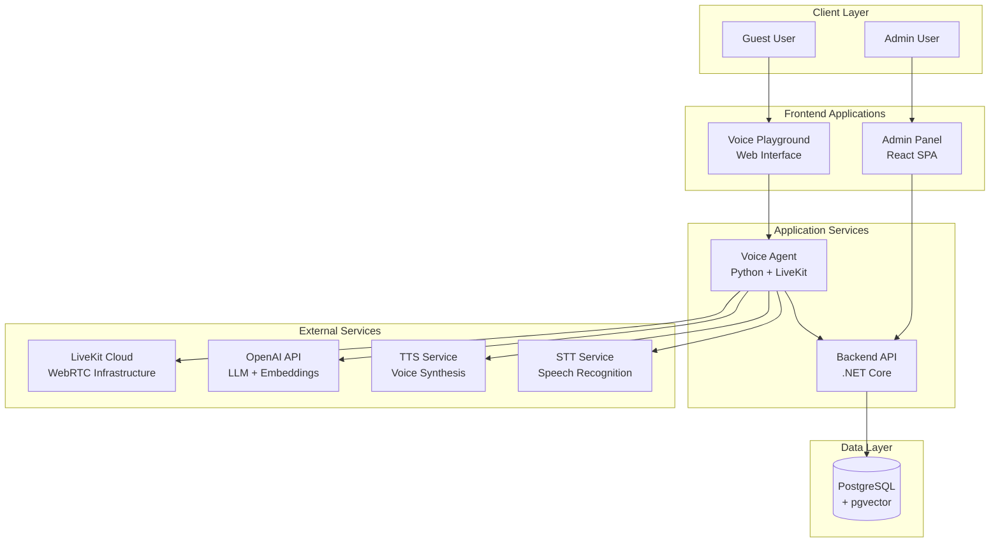
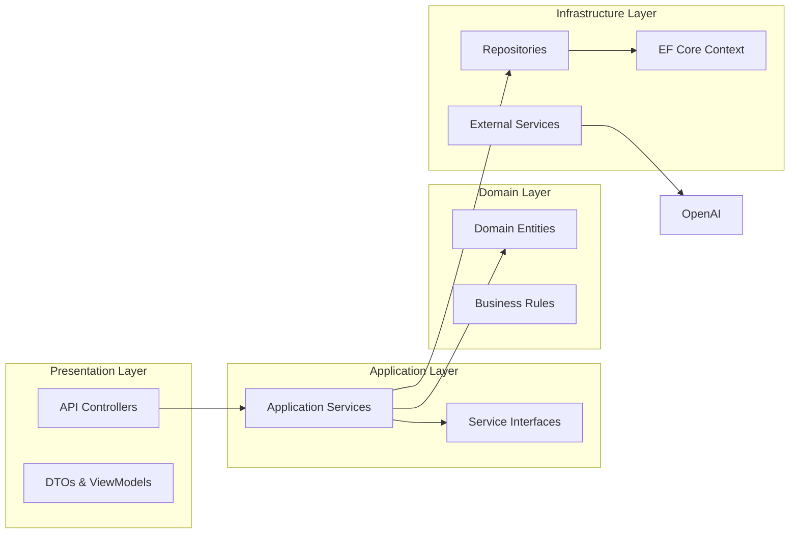
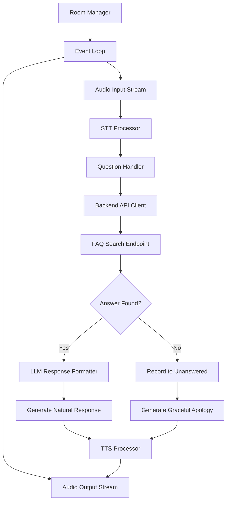
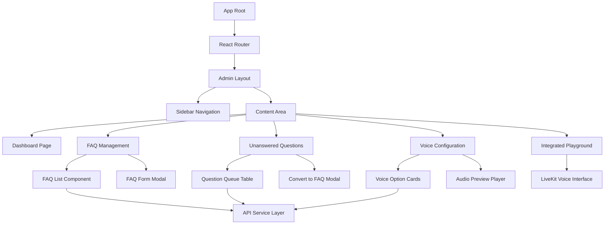
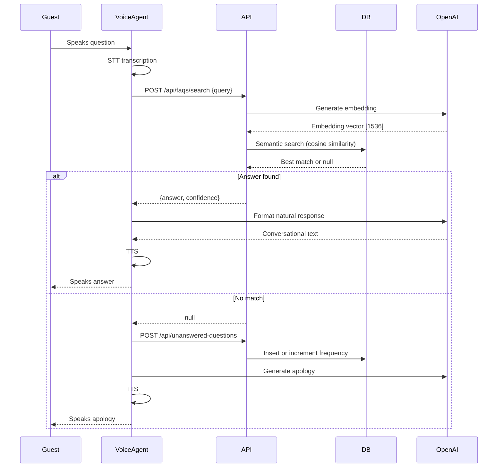
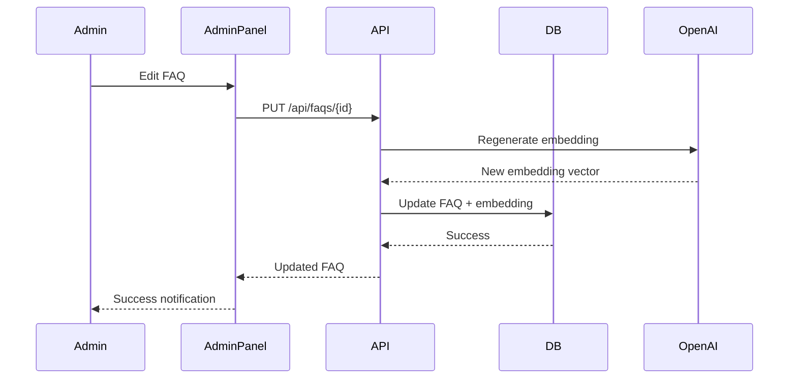
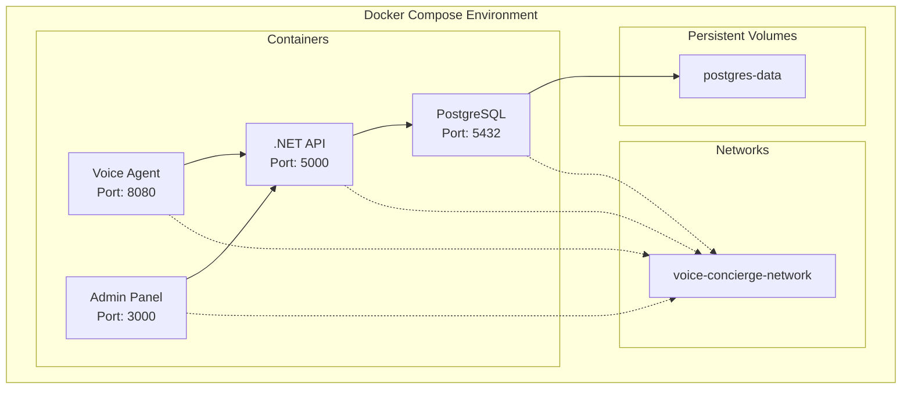

# System Patterns: Voice Concierge Architecture

## High-Level Architecture



## Component Architecture

### 1. Backend API (.NET Core)

**Clean Architecture Pattern**



**Project Structure**
```
backend/
├── src/
│   ├── VoiceConcierge.API/              # Presentation Layer
│   │   ├── Controllers/                 # REST endpoints
│   │   ├── DTOs/                        # Data transfer objects
│   │   ├── Middleware/                  # Error handling, logging
│   │   └── Program.cs                   # App configuration
│   │
│   ├── VoiceConcierge.Core/            # Domain + Application Layer
│   │   ├── Domain/
│   │   │   ├── Entities/               # FAQ, UnansweredQuestion, VoiceConfig
│   │   │   └── Interfaces/             # Repository contracts
│   │   ├── Services/                   # Business logic
│   │   │   ├── FAQService
│   │   │   ├── EmbeddingService
│   │   │   ├── SemanticSearchService
│   │   │   └── VoiceService
│   │   └── DTOs/                       # Shared data contracts
│   │
│   └── VoiceConcierge.Infrastructure/  # Infrastructure Layer
│       ├── Data/
│       │   ├── ApplicationDbContext    # EF Core context
│       │   ├── Migrations/             # Database migrations
│       │   └── Repositories/           # Data access implementations
│       └── External/
│           └── OpenAIClient            # OpenAI API integration
```

### 2. Voice Agent (Python)

**Event-Driven Architecture with LiveKit**



**Project Structure**
```
voice-agent/
├── agent/
│   ├── main.py                    # Entry point, LiveKit connection
│   ├── conversation_manager.py    # Conversation state and flow
│   ├── question_handler.py        # Question processing logic
│   ├── api_client.py              # Backend API integration
│   ├── llm_service.py             # OpenAI LLM integration
│   ├── voice_config.py            # Voice configuration management
│   └── prompts/
│       ├── system_prompt.py       # Base concierge personality
│       └── response_templates.py  # Response formatting
├── requirements.txt
└── Dockerfile
```

### 3. Admin Panel (React)

**Component-Based SPA Architecture**



**Project Structure**
```
admin-panel/
├── src/
│   ├── components/
│   │   ├── layout/
│   │   │   ├── Sidebar.tsx
│   │   │   └── Header.tsx
│   │   ├── faq/
│   │   │   ├── FAQList.tsx
│   │   │   ├── FAQForm.tsx
│   │   │   └── FAQTable.tsx
│   │   ├── questions/
│   │   │   ├── QuestionQueue.tsx
│   │   │   └── ConvertModal.tsx
│   │   ├── voice/
│   │   │   ├── VoiceCard.tsx
│   │   │   └── VoicePreview.tsx
│   │   └── playground/
│   │       └── VoiceInterface.tsx
│   ├── pages/
│   │   ├── Dashboard.tsx
│   │   ├── FAQManagement.tsx
│   │   ├── UnansweredQuestions.tsx
│   │   ├── VoiceConfiguration.tsx
│   │   └── Playground.tsx
│   ├── services/
│   │   └── api.ts              # Axios client, API calls
│   ├── types/
│   │   └── models.ts           # TypeScript interfaces
│   ├── App.tsx
│   └── main.tsx
```

## Key Design Patterns

### 1. Repository Pattern (Backend)

**Purpose**: Abstract data access, enable testability

```csharp
// Interface in Core
public interface IFAQRepository
{
    Task<List<FAQ>> GetAllAsync();
    Task<FAQ?> GetByIdAsync(Guid id);
    Task<List<SemanticSearchResult>> SearchAsync(float[] embedding, int limit);
    Task<FAQ> CreateAsync(FAQ faq);
    Task UpdateAsync(FAQ faq);
    Task DeleteAsync(Guid id);
}

// Implementation in Infrastructure
public class FAQRepository : IFAQRepository
{
    private readonly ApplicationDbContext _context;
    // Implementation with EF Core
}
```

### 2. Service Layer Pattern (Backend)

**Purpose**: Encapsulate business logic, orchestrate operations

```csharp
public class FAQService
{
    private readonly IFAQRepository _faqRepository;
    private readonly IEmbeddingService _embeddingService;
    
    public async Task<FAQ> CreateFAQAsync(CreateFAQDto dto)
    {
        // Generate embedding
        var embedding = await _embeddingService.GenerateAsync(dto.Question);
        
        // Create entity
        var faq = new FAQ 
        { 
            Question = dto.Question,
            Answer = dto.Answer,
            Embedding = embedding
        };
        
        // Save
        return await _faqRepository.CreateAsync(faq);
    }
}
```

### 3. Event-Driven Pattern (Voice Agent)

**Purpose**: Handle real-time voice interactions asynchronously

```python
@voice_agent.on("track_subscribed")
async def on_track_subscribed(track, participant):
    """Handle incoming audio from guest"""
    audio_stream = AudioInputStream(track)
    
    async for text in speech_to_text(audio_stream):
        response = await handle_question(text)
        await speak_response(response)
```

### 4. Semantic Search Pattern

**Purpose**: Natural language understanding for FAQ matching

**Flow:**
1. Generate embedding for incoming question (OpenAI API)
2. Compute cosine similarity with all FAQ embeddings (pgvector)
3. Return matches above similarity threshold
4. Select best match (lowest distance)

```sql
-- PostgreSQL with pgvector
SELECT 
    id, 
    question, 
    answer,
    embedding <=> $1 as distance
FROM faqs
WHERE embedding <=> $1 < 0.3  -- similarity threshold
ORDER BY distance
LIMIT 1;
```

### 5. Adapter Pattern (External Services)

**Purpose**: Isolate external service dependencies

```csharp
public interface IEmbeddingService
{
    Task<float[]> GenerateEmbeddingAsync(string text);
}

public class OpenAIEmbeddingService : IEmbeddingService
{
    // Can swap for different provider without changing consumers
}
```

## Data Flow Patterns

### FAQ Search Flow



### Admin FAQ Update Flow



## Component Communication

### Backend ↔ Voice Agent
- **Protocol**: HTTP REST
- **Format**: JSON
- **Endpoints**: 
  - `POST /api/faqs/search` - Semantic search
  - `POST /api/unanswered-questions` - Record unknown
  - `GET /api/voice-configurations/active` - Get active voice

### Admin Panel ↔ Backend API
- **Protocol**: HTTP REST
- **Format**: JSON
- **Authentication**: None (out of scope)
- **CORS**: Enabled for localhost

### Voice Agent ↔ LiveKit
- **Protocol**: WebRTC
- **Format**: Audio streams
- **Connection**: Persistent room connection

### Voice Agent ↔ OpenAI
- **Protocol**: HTTPS REST
- **Services Used**:
  - Embeddings API (text-embedding-3-small)
  - Chat Completions API (gpt-4 or gpt-3.5-turbo)
  - TTS API or alternative provider

## Deployment Architecture



## Scalability Considerations

### Current Architecture (Single Instance)
- Suitable for assessment and moderate load
- Single voice agent instance
- Single API instance
- Single database

### Future Scaling Paths
1. **Horizontal Scaling**
   - Multiple voice agent instances (LiveKit handles load balancing)
   - Multiple API instances (behind load balancer)
   - Database read replicas

2. **Caching Layer**
   - Redis for frequent FAQ lookups
   - Cache active voice configuration
   - Cache embeddings (immutable)

3. **Message Queue**
   - Async embedding generation
   - Batch processing for unanswered questions
   - Event streaming for analytics

4. **CDN**
   - Voice preview audio files
   - Admin panel static assets

## Security Patterns

### API Security
- Input validation on all endpoints
- Parameterized queries (SQL injection prevention)
- CORS configuration
- Rate limiting (future)

### Data Security
- Environment variables for secrets
- No hardcoded credentials
- Database connection string in .env
- API keys in .env

### Voice Agent Security
- LiveKit token validation
- Secure WebRTC connections
- No PII logging

## Error Handling Strategy

### Backend API
- Global exception middleware
- Structured error responses
- HTTP status codes (400, 404, 500)
- Detailed logging

### Voice Agent
- Graceful degradation
- Connection retry logic
- Fallback responses
- Error logging without interrupting conversation

### Admin Panel
- Toast notifications for errors
- Form validation
- Loading states
- Retry mechanisms
